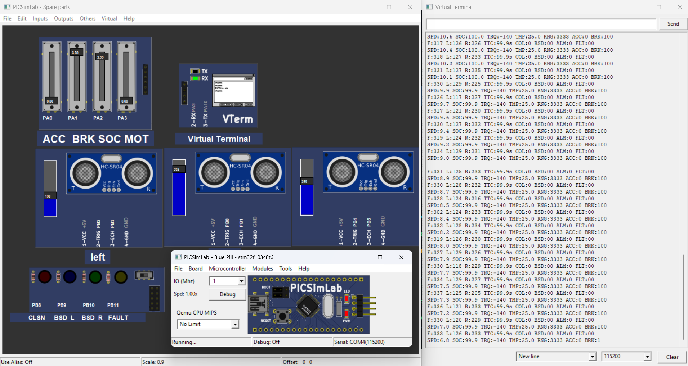
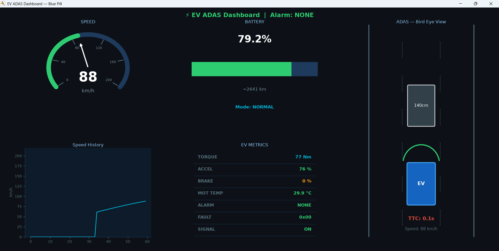

# EV ADAS Dashboard

## 📌 Project Overview

A complete Electric Vehicle Advanced Driver Assistance System (ADAS) Dashboard built during the Embedded Systems Internship at **Emertxe Information Technologies**.

The system uses an STM32F103C8T6 (Blue Pill) microcontroller to read sensor data, process EV dynamics, detect obstacles, and stream telemetry to a Python dashboard over UART.

## 🚀 Features

### Electric Vehicle Monitoring
- Real-time Speed (0-200 km/h)
- State of Charge (SOC) with Range Estimation
- Motor Torque & Power
- Motor Temperature Monitoring
- 3 Drive Modes: ECO, NORMAL, SPORT

### ADAS Safety Features
- Forward Collision Warning (Distance & TTC based)
- Blind Spot Detection (Left & Right)
- Priority-based Alarm System (P0-P3)
- Hysteresis Logic for Stable Alerts

### Vehicle State Machine
- **PARKED**, **READY**, **DRIVING**, **REGEN**, **FAULT**

### Telemetry & Visualization
- UART Communication @ 115200 baud
- Python Dashboard with matplotlib
- Live Speedometer, SOC Gauge, ADAS Bird-Eye View
- Speed History Graph & EV Metrics Panel

## 🛠️ Tech Used

| Category | Tech |
|----------|--------------|
| Microcontroller | STM32F103C8T6 (Blue Pill) |
| Firmware | Embedded C, STM32 HAL, ARM Cortex-M3 |
| Sensors | 3x HC-SR04 Ultrasonic Sensors |
| Simulation | PICSimLab |
| Dashboard | Python, matplotlib, pyserial |
| Communication | UART @ 115200 baud |
| Peripherals | ADC, TIM, GPIO, PWM |

### 🗂️ Project Architecture

| Directory / File | Description |
| :--- | :--- |
| 📁 **Core/** | Contains all C firmware for the microcontroller. |
| ├── 📁 `Inc/` | Header files defining function prototypes and global constants. |
| ├── 📁 `Src/` | Main C implementation files handling core logic. |
| 📄 common.h | Contains shared macros, global configurations, and standard includes used across all modules.
| 📄 `adas.c/.h` | Logic for Advanced Driver Assistance Systems (e.g., obstacle detection). |
| 📄 `ev_control.c/.h` | Core logic for electric vehicle power and motor control. |
| 📄 `ultrasonic.c/.h` | Drivers for reading raw sensor data from ultrasonic modules. |
| 📄 `fault.c/.h` | Error handling, system diagnostics, and fail-safe triggers. |
| 📄 `uart_shell.c/.h` | Serial communication setup to talk to the dashboard. |
| 📁 **Python/** | Contains the desktop-side software. |
| ├── 🐍 `dashboard.py`| The main GUI script for visualizing ADAS data in real-time. |

## 🎥 Demo Video & Architecture

## 📸 Interface & Simulation Demo

### 🛠️ 1. Hardware Simulation Layer (PICSimLab)
The core embedded system simulates an **STM32 Blue Pill** microcontroller interacting with multiple peripheral modules in real-time.

* **Inputs & Controls:** Sliders simulate Accelerator (ACC), Brake (BRK), State of Charge (SOC), and Motor Temperature (MOT).
* **Sensors:** 3x HC-SR04 ultrasonic distance sensor modules track clearance mapping (Left, Center, Right).
* **Output Stream:** Raw telemetry logs string-formatted and transmitted live via the Virtual Terminal (VTerm) over a `115200` baud UART bus.

---

### 🖥️ 2. Telemetry Graphical User Interface (Python Dashboard)
The high-fidelity desktop UI receives the serial packets, parses the incoming variables, and plots system stability.

* **Dynamic Gauges:** Tracks instantaneous velocity (88 km/h), state of charge (79.2%), and thermal performance.
* **ADAS Bird-Eye Module:** Implements spatial mapping, updating the physical position of detected hazards alongside real-time **Time-To-Collision (TTC)** metrics.
* **Historical Trends:** A rolling Matplotlib line chart captures transient speed changes across runtime intervals.
